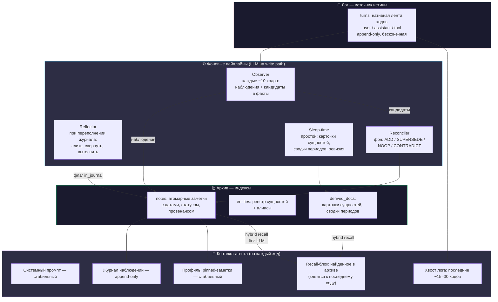
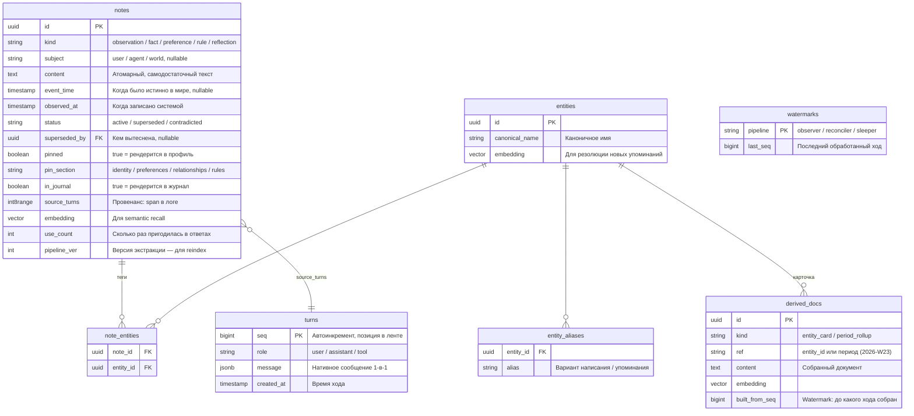
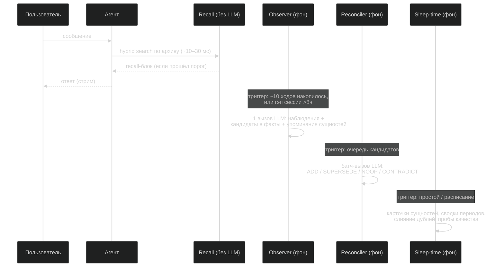

# Память: лог + журнал + архив — альтернативная архитектура

Альтернатива к раннему драфту конвейера STM → BTM → LTM (`memory_architecture.md`, удалён в v29.4.0 — эта архитектура победила и реализована в `core/src/bestfiend/memory/`). Цель та же: условно бесконечная память для бесконечного диалога в одном чате, с персонализацией. Подход другой: вместо конвейера STM → BTM → LTM, по которому данные движутся и трансформируются, — неподвижный лог и перестраиваемые индексы над ним.

## Чем отличается от текущего драфта — кратко

| Вопрос | Текущий драфт | Эта архитектура | Мотив |
|---|---|---|---|
| Источник истины | данные движутся STM → BTM → LTM | лог неподвижен; всё остальное — индексы, которые можно снести и перестроить | пайплайны памяти v1 будут ошибаться; перестраиваемость прощает ошибки |
| Среднее звено | topics + формула устаревания (K, P, каскад) | append-only журнал датированных наблюдений | нет магических констант; журнал стабилен → кеш промпта; даты решают темпоральные вопросы |
| Фильтр мусора | LLM-вызов на каждую пару (ephemeral) | нет; фильтрация — побочный эффект Observer | минус вызов на пару; нет необратимого раннего решения «это мусор» |
| Структура LTM | граф: ноды + рёбра с таксономией | атомарные заметки + теги сущностей + производные документы | граф — самая дорогая часть (entity resolution, traversal); 90% запросов entity-центричны и закрываются тегами |
| Противоречия | «истинно пока не опровергнуто», механизм не задан | supersede/contradict со статусами, bitemporal-время | knowledge updates — слабое место всех систем по LongMemEval; нужен явный механизм |
| Поиск | embedding-точки входа + N-hop traversal | гибрид: vector + лексический + теги сущностей + время, fusion | N-hop без весов топит контекст соседями; гибрид — стандарт с измеренным эффектом |
| Задержка знаний | факт ждёт закрытия topic, до этого живёт только в саммари | Observer отстаёт от головы диалога на ≤10 ходов | в драфте есть «дыра»: знание уже ушло из STM, но ещё не дошло до LTM |
| Кеш промпта | не рассматривался | префикс стабилен по построению | 4–10× экономия токенов на длинном диалоге |
| Наблюдаемость | нет | ops-лог + автогенерируемые пробы | без метрик ни одна константа не тюнится |

Принципы драфта, которые сохранены без изменений: память условно бесконечная; нет устаревания по wall-clock времени; LLM не стоит на пути поиска; LLM работает на пути записи; память универсальна по домену; забывание — это снижение видимости, не удаление.

## Ключевая идея

Память — не три хранилища, между которыми переливаются данные. Память — это **один лог и три представления над ним**, каждое со своим разрешением:

1. **Лог** — сырая лента ходов. Бесконечная, append-only, единственный источник истины. Это текущая «прямая история» — она уже есть.
2. **Журнал наблюдений** — датированные плотные заметки о происходящем. Живёт в контексте целиком. Сжатие 3–6× относительно сырых ходов.
3. **Архив** — атомарные заметки с тегами сущностей + производные документы (карточки сущностей, сводки периодов). Достаётся поиском.

Плюс **профиль** — always-on срез архива (закреплённые заметки), рендерится в системный промпт.

Всё, кроме лога, перестраиваемо. Снести архив и журнал, прогнать пайплайн по логу заново — память восстановится. Это даёт три свойства, которых нет у конвейера: ошибки извлечения не фатальны; пайплайн можно апгрейдить задним числом (новая модель → reindex прошлого); память включается на уже существующей истории ретроактивно.



## Модель данных

### Заметка — единственный атом

В драфте «всё — нода графа». Здесь «всё — заметка» (note): наблюдение, факт, предпочтение, правило поведения, рефлексия. Один тип хранения, одна механика жизненного цикла. Разница поведения — поле `kind`, как поведенческий trait в драфте:

- `observation` — датированная запись о событии: «2026-06-09: пользователь решил перейти на SeaweedFS, причина — typeless-редизайн». Иммутабельна. Основной продукт Observer.
- `fact` — утверждение с областью истинности: «хранилище артефактов — SeaweedFS». Может быть вытеснено новым фактом (supersede).
- `preference` — устойчивое предпочтение пользователя: «не любит длинные преамбулы в ответах».
- `rule` — правило поведения агента, выведенное из обратной связи: «при rollback по умолчанию revert, не force-push».
- `reflection` — сводная заметка, созданная Reflector из группы наблюдений.

Profile, журнал, карточки — не отдельные хранилища, а **выборки заметок по флагам**: `pinned = true` → профиль; `in_journal = true` → журнал. «Переместить из журнала в архив» = снять флаг. Данные не движутся никогда.

### Субъект — о ком знание

Ортогональная оси `kind` колонка `subject`: `kind` отвечает «как знание живёт» (журнал/архив/производное), `subject` — «о ком оно»:

- `user` — пользователь и его жизнь: биография, окружение, планы, события с ним.
- `agent` — сам ассистент: поведение, правила работы, как отвечать.
- `world` — внешний мир: технологии, проекты, факты, не привязанные лично к пользователю.

Модель классифицирует только свободные kind'ы — `fact` и `observation`. Для `preference`/`rule` субъект детерминирован самим kind (`preference→user`, `rule→agent`) и прибивается кодом; производные агрегаты (`reflection`, `entity_card`, `period_summary`) — `NULL` (смешанные по построению). Инвариант держится в одном шве — на границе вставки (`NotesRepository`), мимо него не пишет ни один пайплайн. Наружу ось видна как фильтр `subjects` в `memory_search`; дальняя цель — постоянные эволюционирующие блоки контекста по субъекту (требования пользователя, стиль диалога агента).

### Bitemporal-время

У каждой заметки два времени — это решает противоречия и темпоральные вопросы (самая провальная категория во всех бенчмарках памяти):

- `event_time` — когда это было истинно или произошло в мире. Извлекается из содержания, может быть null.
- `observed_at` — когда система это записала. Всегда есть.

Статусы вместо удаления:

- `active` — действует.
- `superseded` — вытеснена более новой заметкой (`superseded_by` указывает на неё). История сохранена: «жил в Москве (до 2026-03), живёт в Берлине (с 2026-03)» — обе заметки в базе, активна вторая.
- `contradicted` — конфликт без явного победителя. Обе заметки живы и помечены. При recall конфликт всплывает в контекст агента — он уточнит у пользователя естественным образом, в диалоге.

### Схема



Всё живёт в Postgres + pgvector. Лексический поиск — встроенный FTS (+ pg_trgm для имён и кода). Никаких новых сервисов: ни графовой БД, ни отдельного поискового движка. `watermarks` делают каждый пайплайн идемпотентным: упал — перезапустился с последней позиции; reindex = сброс watermark + фильтр по `pipeline_ver`.

## Write path

Синхронных LLM-вызовов на пути «сообщение → ответ» — **ноль**. Всё извлечение — фоном, позади головы диалога.



### Observer — один вызов вместо трёх

Триггер: накопилось ~10 ходов, или гэп сессии (>8ч), или переполнение хвоста в контексте. Вход: необработанные ходы (по watermark) + хвост журнала для связности. Один structured-вызов, три выхода:

```python
class Observation(BaseModel):
    """Датированная запись: что произошло, что решили, что сказал пользователь"""
    content: str                  # Плотный самодостаточный текст
    event_time: datetime | None   # Если событие привязано ко времени в мире
    entities: list[str]           # Упоминания сущностей (имена/алиасы)
    weight: Literal["high", "mid", "low"]  # Для порядка вытеснения из журнала

class FactCandidate(BaseModel):
    """Кандидат в долгосрочное знание — пойдёт через Reconciler"""
    content: str
    kind: Literal["fact", "preference", "rule"]
    entities: list[str]
    event_time: datetime | None

class ObserverOutput(BaseModel):
    observations: list[Observation]
    candidates: list[FactCandidate]
    new_entities: list[str]       # Сущности, которых нет в реестре
```

Этот один вызов заменяет три механизма драфта: ephemeral-фильтр (мусорные ходы просто не порождают наблюдений — фильтрация бесплатна), саммаризацию topics (наблюдения и есть сжатие) и частично LTM extraction (кандидаты). Из болтовни Observer извлечёт пустой список — и это нормально: сырой лог всё равно хранит всё, ошибка цены не имеет.

Тул-тяжёлые ходы (оркестрация, длинные tool-результаты) сжимаются сильнее всего — наблюдение фиксирует «что сделали и чем кончилось», а не трассу. На таких участках сжатие достигает десятков раз.

### Reconciler — судьба кандидатов

Фоновый батч. Для каждого кандидата: достать топ-K похожих активных заметок (vector + общие сущности) → один LLM-вызов на батч решает:

- `ADD` — новое знание, записать.
- `SUPERSEDE` — вытесняет конкретную старую заметку (статус + ссылка). Старая остаётся в истории.
- `NOOP` — уже знаем, дубль.
- `CONTRADICT` — конфликт без победителя, пометить обе.

Это Mem0-схема операций, скрещённая с Graphiti-принципом «инвалидировать, не удалять». V1 можно запустить вообще без Reconciler — в режиме ADD-only (новейший Mem0 так и сделал: дубли терпимы, гибридный поиск всё равно находит нужное). Reconciler добавляется, когда дубли начнут мешать.

Промоушен в профиль — частный случай: Reconciler ставит `pinned`, если кандидат general (не привязан к эпизоду), стабилен (не противоречит активным) и относится к пользователю/правилам работы. Снятие `pinned` при переполнении бюджета профиля — демоция, не потеря: заметка остаётся в архиве и находится поиском.

### Reflector — переполнение журнала

Журнал append-only, пока влезает в бюджет (~4–8k токенов). При переполнении Reflector одним вызовом: сливает связанные наблюдения в `reflection`-заметки, снимает `in_journal` с вытесненных (порядок: сначала `low`-weight и superseded). Вытесненное никуда не переносится — оно уже в архиве, просто перестаёт рендериться в контекст.

Это плановая инвалидация кеша промпта — единственное событие, которое перестраивает префикс. Происходит редко (раз в десятки ходов), в отличие от topics-механики, которая трогает BTM-блок при каждой саммаризации.

### Sleep-time — консолидация

Триггер: пользователь молчит N минут, или расписание. Задачи, все идемпотентные по watermark:

- **Карточки сущностей** — для горячих сущностей (много заметок, высокий `use_count`) собрать один документ: «всё важное про X». Это предвычисленный ответ на самый частый класс запросов к памяти. Карточка участвует в recall как первоклассный кандидат и почти всегда выигрывает у россыпи отдельных заметок.
- **Сводки периодов** — неделя/месяц из наблюдений. Закрывают запросы вида «что было в марте», «чем занимались на прошлой неделе».
- **Ревизия** — слияние почти-дублей, абстрагирование паттернов («трижды откладывал X» → заметка-привычка), деактивация заметок с нулевым использованием и низкой связностью (снижение видимости, не удаление).

Это слой Letta sleep-time: тяжёлая работа памяти уходит из горячего пути в простой.

## Read path

### Сборка контекста и кеш

Порядок собран под prompt caching — от стабильного к волатильному:

```
[системный промпт]          — меняется при деплое
[профиль: pinned-заметки]   — меняется редко (промоушен/демоция)
[журнал наблюдений]         — append-only, перестройка только Reflector'ом
[хвост лога: ~15–30 ходов]  — скользит, но это конец префикса
[recall-блок + сообщение]   — волатильная часть, клеится к последнему ходу
```

Recall-блок прикрепляется к последнему user-ходу (системная вставка), а не в начало промпта — иначе каждый ход инвалидировал бы весь кеш. На длинном диалоге стабильный префикс даёт 4–10× экономию входных токенов — это измеренный эффект append-only журнала у Mastra, не гипотеза.

Хвост лога сознательно умеренный даже при больших окнах: длинный сырой хвост деградирует качество (lost-in-the-middle), а всё старше хвоста уже представлено журналом плотнее и полезнее.

### Автоматический recall — без LLM

На каждый ход, ~10–30 мс:

1. **Запрос** = текущее сообщение + рабочее множество сущностей (см. ниже). Без LLM-переформулировок.
2. **Четыре списка кандидатов параллельно**: vector KNN по embedding; FTS/trgm по тексту (имена, идентификаторы, код — то, что embeddings размазывают); точное совпадение тегов сущностей из рабочего множества; при наличии временных маркеров в запросе — фильтр по `event_time` (time-aware сужение даёт +7–11% именно на темпоральных вопросах).
3. **Fusion** — Reciprocal Rank Fusion: `score(d) = Σ 1/(60 + rank_l(d))`. Без обучаемых весов, устойчив к разнородным шкалам. Взвешенную формулу с `use_count`-бустом вводить только после появления eval-метрик — иначе тюнить не по чему.
4. **Gate** — порог на топ-скор. Не прошёл — recall-блок не вставляется вовсе. Пустой результат — первоклассный исход: мусорные слабые совпадения загрязняют контекст хуже, чем их отсутствие. Бюджет блока адаптивный: 0–4k токенов по числу прошедших порог.

Карточки сущностей и сводки периодов конкурируют в том же пуле кандидатов — и за счёт плотности обычно вытесняют отдельные заметки.

### Рабочее множество сущностей

Дешёвый трекер салиентности — какие сущности «активны» в разговоре сейчас:

```
activation(e) = Σ γ^Δ   по всем упоминаниям e,
Δ — давность упоминания в ходах (не в минутах), γ ≈ 0.8
```

Упоминания ловятся матчем по реестру алиасов (без LLM). Затухание — по ходам диалога, не по wall-clock: принцип «нет устаревания по времени» соблюдён, пауза на сон активацию не трогает. Это spreading-activation в одну итерацию — та же механика, которую драфт искал в «достижимости от точек входа», но со скаляром вместо обхода графа: рёбер нет, есть веса.

### Агентные инструменты — выход за пределы автоматики

Автоматический recall покрывает типовое. Для хвоста запросов («а что мы решали про X в прошлом году?») у агента есть инструменты — это его осознанная трата хода, не скрытая задержка:

- `memory_search(query, entities?, time_range?, kinds?)` — тот же hybrid recall, но параметризованный.
- `memory_read_log(from_seq, to_seq)` — сырой кусок ленты. Каждая заметка несёт `source_turns` — агент может «вспомнить сцену дословно», дойдя от заметки до первоисточника. Это страховка от ошибок сжатия: журнал и архив могут потерять деталь, лог — нет.
- `memory_save(content, kind, pin?)` — явное «запомни»: мимо очереди Observer, мгновенно.
- `memory_revise(note_id, correction)` — supersede по слову пользователя: «я больше не на Windows» → старая заметка вытеснена, с провенансом.

Два последних — одновременно и механизм обратной связи: пользователь видит, что память поправлена, и может спросить «что ты обо мне помнишь» (рендер pinned + горячих заметок с провенансом).

## Бюджет контекста

Распределение **динамическое** — доли фактического окна модели графа, не фиксированные числа. Размер окна берётся из `context_window` в config jsonb (таблица `models`) и читается через `AIConfig.context_window`. Минимальное поддерживаемое окно — 32k (под него подобраны floor'ы ниже). Бюджет считается на каждый запрос в **read-path** — это сборка контекста под одну модель. Write-path (Observer, Reflector, sleep-time) бюджетом не управляется: там ограничения условные, заданы промптом на каждую сущность.

### Раскладка окна

Три первоочередных потребителя вычитаются сразу — их ужать нельзя:

```
working = context_window − output_reserve − current_input_tokens
```

- `output_reserve` = `max_tokens` (config) — запас на ответ модели.
- `current_input_tokens` — фактический размер текущего хода (`count_tokens`). Текущий вход идёт в промпт целиком и не режется (в отличие от истории), поэтому вычитается наравне с запасом на ответ.

Остаток (`working`) раскладывается плоско: каждый блок берёт долю окна, зажатую между рабочим минимумом и потолком.

```
journal  = clamp(working × journal_pct,  journal_floor,  journal_cap)
profile  = clamp(working × profile_pct,  profile_floor,  profile_cap)
recall   = clamp(working × recall_pct,   recall_floor,   recall_cap)
log_tail = clamp(working − Σ(journal + profile + recall),  tail_floor, tail_cap)
```

Почему clamp, а не чистый процент: линейная доля не масштабируется в обе стороны. Большому окну память не нужна пропорционально — `cap` гасит раздувание, излишек уходит в свободный запас. Малому окну память нужна почти в том же абсолюте — `floor` держит журнал и recall живыми (журнал в 1000 токенов бесполезен хоть на 32k, хоть на 128k). Сырая STM (`log_tail`) сидит не в проценте, а в остатке окна, но тоже под `cap`: длинный сырой хвост топит точность (lost-in-the-middle), а всё старше хвоста уже плотнее представлено журналом.

Пример при дефолтных ручках (journal 0.08/1500/8000, profile 0.03/800/3000, recall 0.06/1000/6000, tail —/6000/40000), малый текущий вход:

```
                       128k, reserve 20k          32k, reserve 4k
working                108 000                    28 000
  journal                8 000  (cap ⬇)            2 240
  profile                3 000  (cap ⬇)              840
  recall                 6 000  (cap ⬇)            1 680
  log_tail              40 000  (cap ⬇)           23 240
свободный запас         51 000                         0
```

### Большой единичный вход

Поскольку `current_input_tokens` вычитается из `working`, крупный вход сам ужимает память — раскладка не переполняет окно. Вход 80k на окне 128k:

```
context_window        128 000
  output_reserve       20 000
  current_input        80 000
  working = 28 000 → journal 2 240 / profile 840 / recall 1 680 / log_tail 23 240
итог промпта: 80k + 20k + 28k = 128k ✅
```

Три исхода по размеру входа:

| Вход | Исход |
|---|---|
| Умеренный (`working` ≥ Σ floor) | память ужимается долями и floor'ами, всё влезает |
| Большой (`working` < Σ floor) | fail-soft: память выключается, в промпт только вход + хвост-сколько-влезет, варн в лог |
| `output_reserve + input ≥ окна` | переполнение по самому входу — планировщик не спасает |

Третий случай **вне ответственности планировщика**: гигантский единичный вход (вставленный файл, дамп) лечится отдельным механизмом — pre-truncation или ingress в артефакт (ссылка + summary в промпт, агент дочитывает tool'ом). Планировщик его детектит и сигналит, не молчит.

### Контракт и ручки

```
plan_read_budget(window, output_reserve, input_tokens) → ReadBudget(journal, profile, recall, log_tail)
```

Живёт в `memory/budget.py`, вызывается в read-path после резолва модели графа. Точки врезки: `load_log_tail` (хвост), recall `_apply_budget`, рендер journal/profile, детект большого входа.

`.env`-ручки — на блок (pct/floor/cap), плюс floor/cap для хвоста:

```
journal_pct   journal_floor   journal_cap
profile_pct   profile_floor   profile_cap
recall_pct    recall_floor    recall_cap
              log_tail_floor  log_tail_cap
```

«Бесконечность» памяти обеспечивается не окном, а парой лог + ANN-поиск: лог растёт на диске линейно и дёшево, стоимость поиска — логарифмически. Окно лишь определяет, сколько свежего и найденного влезает в один промпт.

Стоимость LLM на запись, амортизированно на пару сообщений: Observer ≈ 0.1 вызова (раз в ~10 ходов), Reconciler ≈ 0.05 (батчи), Reflector и sleep-time ≈ 0.02. Итого **~0.15–0.2 вызова на пару** против 1+ в драфте (ephemeral-фильтр на каждую пару плюс саммаризации) — при нуле синхронных вызовов.

## Персонализация

Профиль — рендер pinned-заметок по секциям:

- `identity` — кто пользователь: роль, проекты, окружение.
- `preferences` — как ему отвечать: стиль, формат, язык, глубина.
- `relationships` — постоянные люди/сущности вокруг.
- `rules` — обратная связь как правила работы агента: выведенные Reconciler'ом из коррекций и явно сохранённые.

Жизненный цикл един с остальной памятью: кандидаты из Observer → Reconciler промоутит → переполнение бюджета секции демотирует наименее используемые в архив. Каждая запись профиля несёт провенанс — «почему ты так решил?» всегда отвечаемо ссылкой на исходный эпизод. Это и есть «LTM always-on» драфта, но с определённым механизмом обновления, потолком и демоцией вместо открытых вопросов.

## Наблюдаемость и eval

Без этого слоя ни один порог не настраивается — он не опционален:

- **Ops-лог** — каждая операция пайплайнов (что извлекли, что вытеснили, что слили) в `memory_ops`. Дебаг «почему агент это забыл» становится запросом, а не археологией.
- **Метка использования** — recall-блок маркируется; если агент сослался на заметку в ответе, `use_count++`. Сигнал и для ранжирования, и для sleep-time-ревизии.
- **Автопробы** — sleep-time генерирует из свежих заметок вопросы с известным ответом и провенансом («что пользователь решил про X?»), прогоняет через recall, меряет hit@k. Деградация retrieval видна на дашборде до того, как её заметит пользователь.
- Категории качества — как в LongMemEval: извлечение, мульти-сессионный синтез, темпоральность, обновления знаний, abstention.

## Путь к графу

Граф из драфта не выброшен — он отложен до доказанной потребности. Заметки с тегами сущностей уже образуют двудольный граф «заметка—сущность»; co-mention связи между сущностями выводятся запросом. Если появится реальный спрос на мульти-хоп вопросы («кто из коллег жены работал в компании, которую мы обсуждали?»):

1. Добавить таблицу `note_links` / `entity_links` с типами — таксономия рёбер из драфта (structural/causal/temporal/agentive/associative) ложится сюда как есть.
2. Заменить шаг «теги сущностей» в recall на Personalized PageRank по графу, с рабочим множеством как seed (схема HippoRAG). PPR — это «релевантность как достижимость» из драфта, но с весами и затуханием вместо жёсткого N-hop, и по-прежнему без LLM на поиске.

До этого момента граф не строится: entity resolution, поддержание рёбер и настройка traversal — самые дорогие и хрупкие части любой памяти, а окупаются только на редком классе запросов.

## Риски

- **Observer теряет деталь.** Митигция: провенанс + `memory_read_log` — сырой лог всегда достижим; автопробы ловят систематические потери.
- **Дрейф реестра сущностей** (дубли «Егор»/«Humphreey»). Митигация: alias-матч + embedding-кандидаты при создании, слияние дублей в sleep-time; слияние = обновление тегов, не перестройка графа — blast radius мал.
- **Накопление шумных заметок.** Митигация: ADD-only терпим благодаря fusion-поиску; ревизия в sleep-time; в пределе — reindex по `pipeline_ver`.
- **Перестройка журнала ломает кеш.** Плановая и редкая; цена известна и в ~50 раз меньше, чем инвалидация на каждом ходу при retrieval-в-префикс.
- **RU/EN смешанный поиск.** Embeddings — мультиязычная модель; лексика — pg_trgm (терпим к транслиту и опечаткам) поверх FTS.
- **Privacy-стирание.** Единственное легитимное исключение из append-only: явная просьба пользователя «удали это» — hard-delete заметок + редакция span'а в логе.

## Этапы внедрения

**V1 — ядро (даёт 80% ценности):** `notes` + `entities`, Observer, журнал в контексте, сборка префикса под кеш, recall vector+FTS+RRF с gate, `memory_search` + `memory_save`. Без Reconciler (ADD-only), без Reflector (журнал просто короче), без карточек.

**V2 — качество:** Reconciler (supersede/contradict), профиль с промоушеном, Reflector, `memory_revise`, ops-лог.

**V3 — масштаб:** sleep-time (карточки, сводки, ревизия), автопробы и дашборд, use_count-ранжирование, time-aware фильтры; опционально — локальный реранкер, graph-upgrade.

Ретроактивное включение: прогнать Observer по всей существующей истории с нулевого watermark — память появится у диалога, который вёлся до её существования.

## Источники

Что взято и откуда:

- Append-only журнал датированных наблюдений, стабильный префикс, временные якоря, weight-флаги — [Mastra, Observational Memory](https://mastra.ai/research/observational-memory) (94.9% на LongMemEval, лучший результат на темпоральных вопросах).
- Bitemporal-время, supersede вместо удаления, провенанс до эпизода — [Zep: Temporal Knowledge Graph Architecture](https://arxiv.org/abs/2501.13956) и [Graphiti](https://www.getzep.com/ai-agents/temporal-knowledge-graph/).
- Операции ADD/SUPERSEDE/NOOP над атомарными фактами; допустимость ADD-only при гибридном поиске — [Mem0](https://arxiv.org/abs/2504.19413) и [его эволюция](https://www.emergentmind.com/topics/mem0-system).
- Фоновая консолидация в простое — [Letta, Sleep-time Compute](https://www.letta.com/blog/sleep-time-compute), [Sleep-time agents](https://docs.letta.com/guides/agents/architectures/sleeptime/).
- Категории качества памяти, провал темпоральности, эффект time-aware query expansion и fact-augmented summaries — [LongMemEval](https://arxiv.org/abs/2410.10813), [сводка результатов](https://www.emergentmind.com/topics/longmemeval).
- Активация вместо traversal, PPR как upgrade — [HippoRAG](https://arxiv.org/abs/2405.14831); spreading activation в памяти агентов — SYNAPSE (2026), см. [список литературы по памяти агентов](https://github.com/Shichun-Liu/Agent-Memory-Paper-List).
- Самостоятельное управление памятью через инструменты, иерархия core/recall/archival — [MemGPT/Letta](https://arxiv.org/abs/2310.08560).
- Эпизодическая память как недостающий слой — [позиционная статья](https://arxiv.org/pdf/2502.06975); обзор механик и eval — [Memory for Autonomous LLM Agents](https://arxiv.org/html/2603.07670v1).
